# 🛡️ **CYBER MONITOR SUITE** 
### *Advanced Security Monitoring & Threat Detection System*

<div align="center">


[](LICENSE)
[](https://www.python.org/)
[](https://nodejs.org/)
[](https://reactjs.org/)
[](https://www.mongodb.com/)


<p align="center">
  
  
  
  
</p>

</div>

---

## 🎯 **Overview**

<table>
<tr>
<td width="60%">

**Cyber Monitor Suite** is a comprehensive security monitoring solution designed for educational and authorized security testing purposes. It combines cutting-edge technologies to provide real-time system monitoring, threat detection, and instant alert capabilities.

### ⚡ **Key Highlights**
- 🔐 **Enterprise-grade security monitoring**
- 📊 **Real-time analytics dashboard**
- 🚨 **Instant email alerts**
- 🎨 **Modern Material-UI interface**
- 🔄 **Automated data encryption**
- 📱 **Responsive design**

</td>
<td width="40%">


</td>
</tr>
</table>

---

## ✨ **Features**

<div align="center">

| Feature | Description | Status |
|---------|-------------|--------|
| 🔍 **Keystroke Monitoring** | Advanced input tracking with encryption | ✅ Active |
| 📸 **Screenshot Capture** | Automated screen monitoring at intervals | ✅ Active |
| 📹 **Webcam Integration** | Visual security monitoring | ✅ Active |
| 🎤 **Audio Recording** | Environmental sound detection | ✅ Active |
| 📋 **Clipboard Tracking** | Monitor copied content | ✅ Active |
| 💻 **System Information** | Hardware & network details | ✅ Active |
| 📧 **Email Alerts** | Real-time security notifications | ✅ Active |
| 🔐 **Data Encryption** | AES-256 encryption for all logs | ✅ Active |
| 📊 **Analytics Dashboard** | Beautiful data visualization | ✅ Active |
| 🌐 **Web Interface** | Modern React-based UI | ✅ Active |

</div>

---

## 🚀 **Quick Start**

### **Prerequisites**

<div align="center">

| Requirement | Minimum Version | Recommended |
|-------------|----------------|-------------|
| Node.js | 14.0.0 | 18.0.0+ |
| Python | 3.8 | 3.10+ |
| MongoDB | 4.4 | 5.0+ |
| RAM | 4GB | 8GB+ |
| Storage | 500MB | 2GB+ |

</div>

### **🔧 Installation**

```bash
# 1️⃣ Clone the repository
git clone https://github.com/yourusername/cyber-monitor-suite.git
cd cyber-monitor-suite

# 2️⃣ Install dependencies with single command
npm run setup

# 3️⃣ Configure environment variables
cp .env.example .env
# Edit .env with your settings

# 4️⃣ Start everything
npm start
```

<details>
<summary><b>📦 Manual Installation</b></summary>

```bash
# Backend setup
cd backend
npm install

# Frontend setup
cd ../frontend
npm install

# Python dependencies
cd ../backend/python
pip install -r requirements.txt
```

</details>

---

## 🏗️ **Architecture**

```mermaid
graph TB
    A[🖥️ React Frontend] -->|REST API| B[🚀 Node.js Backend]
    B --> C[🗄️ MongoDB]
    B --> D[🐍 Python Core]
    D --> E[📧 Email Service]
    D --> F[🔐 Encryption Module]
    B --> G[📊 Analytics Engine]
    
    style A fill:#61DAFB,stroke:#333,stroke-width:2px
    style B fill:#339933,stroke:#333,stroke-width:2px
    style C fill:#47A248,stroke:#333,stroke-width:2px
    style D fill:#3776AB,stroke:#333,stroke-width:2px
```

<div align="center">



</div>

---

## 📸 **Screenshots**

<div align="center">
<table>
<tr>
<td></td>
<td></td>
</tr>
<tr>
<td align="center"><b>📊 Analytics Dashboard</b></td>
<td align="center"><b>📋 Activity Logs</b></td>
</tr>
<tr>
<td></td>
<td></td>
</tr>
<tr>
<td align="center"><b>🚨 Alert System</b></td>
<td align="center"><b>⚙️ Configuration</b></td>
</tr>
</table>
</div>

---

## 📁 **Project Structure**

```
cyber-monitor-app/
│
├── 📂 backend/
│   ├── 📜 server.js         # Express server
│   ├── 📂 routes/           # API endpoints
│   ├── 📂 models/           # Database schemas
│   └── 📂 python/           # Core monitoring engine
│       ├── 🐍 keylogger.py
│       └── 📋 requirements.txt
│
├── 📂 frontend/
│   ├── 📂 src/
│   │   ├── 📂 components/   # React components
│   │   ├── 📂 services/     # API services
│   │   └── 📜 App.js        # Main application
│   └── 📦 package.json
│
├── 📜 package.json          # Root package with scripts
├── 🔧 setup.js             # Automated setup script
├── 📖 README.md            # You are here!
└── 📄 LICENSE              # MIT License
```

---

## 🎮 **Usage**

### **Starting the Application**

<div align="center">

| Command | Description |
|---------|-------------|
| `npm start` | 🚀 Start all services |
| `npm run backend` | 🔧 Start backend only |
| `npm run frontend` | 🎨 Start frontend only |
| `npm run python` | 🐍 Start Python monitor |
| `npm run setup` | 📦 Install all dependencies |
| `npm run clean` | 🧹 Clean all generated files |

</div>

### **API Endpoints**

```javascript
GET    /api/logs        # Fetch all logs
POST   /api/logs        # Create new log
GET    /api/stats       # Get statistics
POST   /api/alerts/send # Send email alert
GET    /api/settings    # Get configuration
```

---

## ⚠️ **Legal & Ethical Notice**

<div align="center">

### **🚨 IMPORTANT: READ BEFORE USE 🚨**


</div>

```diff
- ❌ ILLEGAL: Using without explicit consent
- ❌ ILLEGAL: Deploying on systems you don't own
- ❌ ILLEGAL: Stealing personal information
- ❌ UNETHICAL: Violating privacy rights

+ ✅ LEGAL: Personal device monitoring
+ ✅ LEGAL: Authorized penetration testing
+ ✅ LEGAL: Parental control (with consent)
+ ✅ LEGAL: Corporate security (with policy)
```

### **📜 Legal Requirements**

1. **Always obtain written consent** before deployment
2. **Follow local and international laws** regarding surveillance
3. **Respect privacy rights** of all individuals
4. **Use only for legitimate security purposes**
5. **Document authorization** for any monitoring activity

---

## 🛠️ **Configuration**

### **Environment Variables**

Create a `.env` file in the backend directory:

```env
# Server Configuration
PORT=5000
NODE_ENV=development

# Database
MONGODB_URI=mongodb://localhost:27017/cybermonitor

# Email Configuration (Gmail)
EMAIL_USER=your-email@gmail.com
EMAIL_PASS=your-app-specific-password  # Use App Password, not regular password
ALERT_EMAIL=recipient@gmail.com

# Security
ENCRYPTION_KEY=your-32-character-key
JWT_SECRET=your-jwt-secret
```

### **Gmail Setup for Alerts**

1. Enable 2-Factor Authentication in your Google Account
2. Generate an App-Specific Password:
   - Go to [Google Account Settings](https://myaccount.google.com/security)
   - Select "2-Step Verification" → "App passwords"
   - Generate password for "Mail"
3. Use the 16-character password in your `.env` file

---

## 🤝 **Contributing**

We welcome contributions! Please see our [Contributing Guidelines](CONTRIBUTING.md) for details.

<div align="center">

### **How to Contribute**

1. 🍴 Fork the repository
2. 🌿 Create your feature branch (`git checkout -b feature/AmazingFeature`)
3. 💾 Commit your changes (`git commit -m 'Add some AmazingFeature'`)
4. 📤 Push to the branch (`git push origin feature/AmazingFeature`)
5. 🎯 Open a Pull Request

</div>

---

## 📈 **Performance Metrics**

<div align="center">

| Metric | Value | Status |
|--------|-------|--------|
| ⚡ Response Time | < 100ms | 🟢 Excellent |
| 💾 Memory Usage | < 200MB | 🟢 Optimal |
| 🔄 CPU Usage | < 5% | 🟢 Low |
| 📊 Data Processing | 1000 logs/sec | 🟢 Fast |
| 🔐 Encryption | AES-256 | 🟢 Secure |

</div>

---

## 🐛 **Troubleshooting**

<details>
<summary><b>MongoDB Connection Issues</b></summary>

```bash
# Check if MongoDB is running
sudo systemctl status mongod

# Start MongoDB
sudo systemctl start mongod
```

</details>

<details>
<summary><b>Email Alerts Not Working</b></summary>

1. Verify Gmail App Password is correct
2. Check firewall settings for port 587
3. Ensure "Less secure app access" is handled via App Passwords

</details>

<details>
<summary><b>Python Module Errors</b></summary>

```bash
# Reinstall Python dependencies
pip install -r requirements.txt --upgrade

# For Windows specific issues
pip install pywin32 --upgrade
```

</details>

---

## 📚 **Documentation**

- 📖 [API Documentation](docs/API.md)
- 🔧 [Configuration Guide](docs/CONFIG.md)
- 🚀 [Deployment Guide](docs/DEPLOY.md)
- 🔒 [Security Best Practices](docs/SECURITY.md)

---

## 🏆 **Acknowledgments**

- Material-UI for the beautiful React components
- MongoDB team for the robust database
- Python community for excellent libraries
- All contributors and testers

---

## 📄 **License**

This project is licensed under the MIT License - see the [LICENSE](LICENSE) file for details.

---

## 📞 **Support**

<div align="center">

### **Need Help?**

[](https://discord.gg/cybermonitor)
[](mailto:support@cybermonitor.com)
[](https://docs.cybermonitor.com)

</div>

---

<div align="center">

### **⭐ Star History**

[](https://star-history.com/#yourusername/cyber-monitor-suite&Date)

### **Made with ❤️ by the Cyber Monitor Team**


</div>


